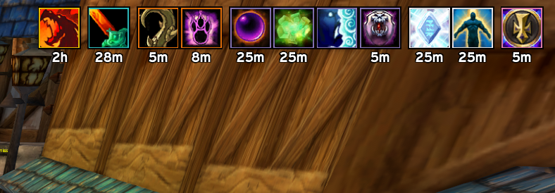

# BuffLedger

A standalone buff bar for vanilla WoW 1.12 (Turtle-based servers) that replaces Blizzard's own player buff frame - and pfUI's, if pfUI is loaded - with one that actually sorts by something meaningful: which class gave you a buff, not the raw order the client happens to report auras in. Class buffs, weapon enchants, consumables, world buffs, and racials each get their own color-coded cluster instead of one undifferentiated row of icons.

## Install

1. Copy the `BuffLedger` folder into `Interface/AddOns/`
2. Enable BuffLedger at the character select addon list

Looks like pfUI by default - the flat near-black border, drop shadow, and Expressway font are bundled straight from pfUI's own files, so it looks right whether or not pfUI is actually installed. Everything is still fully configurable from its own Options window regardless (see below) - it never reads pfUI's live settings, so pfUI being installed doesn't override anything you set here.

## Usage

Drag the bar to reposition it (it starts unlocked). `/bl options` opens a full settings window - icon size, spacing, category gap, columns, font, text size, border thickness, scale, growth direction, and a background panel toggle.

- `/bl` or `/buffledger` - full command list
- `/bl options` (or `/bl opt`, `/bl config`) - settings window
- `/bl lock` / `/bl unlock` - lock the bar in place, or free it to drag again
- `/bl reset` - reset position
- `/bl scan` - scans your current raid/party and reports any buffs it doesn't recognize yet, with a guess at which class they belong to
- `/bl test [0-1 | % | off]` - preview a shuffled sample of every buff this addon knows about, without needing a raid to actually hold them all at once
- `/bl toggle <class|weapon|consumable|world|racial|other>` - show/hide one category

## How it works

The client's aura API has no concept of "who gave you this buff" - it's just a name, icon, and duration. BuffLedger keeps its own lookup table (`Data.lua`) mapping buff names to a source: a specific class, a world buff, a consumable, a racial, or "other" for anything unrecognized. Weapon enchants (sharpening stones, wizard oils, ...) aren't auras at all on this client, so those are read separately via `GetWeaponEnchantInfo()` and shown as their own category.

- **Grouped, not just sorted** - buffs from the same source sit together as one visual cluster, with a configurable gap between clusters. A cluster never splits across rows just because one ran out of horizontal room; it moves to the next row as a whole.
- **Color-coded borders** - class buffs take that class's actual class color; every other category gets its own fixed color (gold for world buffs, green for consumables, etc).
- **Sorted by time remaining within each cluster** - the buff closest to falling off is the most visually prominent one, not buried by alphabetical accident.
- **`/bl scan`** turns "is this buff in the lookup table yet" from a one-at-a-time guessing game into a single command - point it at a full raid and it'll tell you exactly which buffs it doesn't recognize, and which class it thinks each one belongs to.

## Known limitations

- The name-to-class table is hand-maintained. Most standard buffs are already in it, but a private server's custom content can always add something new - if a buff lands in the generic "Other" bucket, that's what happened. `/bl scan` is the fastest way to find and fix these.
- A few consumables display under a short generic effect name in-game rather than the item's own name (e.g. Cerebral Cortex Compound's actual buff is "Infallible Mind") - most of these are already accounted for, but this is a real limitation of matching by aura name at all, not a bug.
- `/bl scan`'s raid-wide read assumes `C_UnitAuras.GetAuraDataByIndex` works against non-player unit tokens (`raid1`, `raid2`, ...) the same way it does for `"player"`. Every confirmed use elsewhere on this client only ever calls it with `"player"`, so this hasn't been independently verified.

## Credits

Built to match the look of [CombatLedger](https://github.com/kobeniiiiii/CombatLedger), [LootLedger](https://github.com/kobeniiiiii/LootLedger), and [CleanRolls](https://github.com/kobeniiiiii/CleanRolls) - the Expressway font and flat backdrop skin are bundled from [pfUI](https://github.com/shagu/pfUI) by Eric Mauser (Shagu), MIT-licensed.
