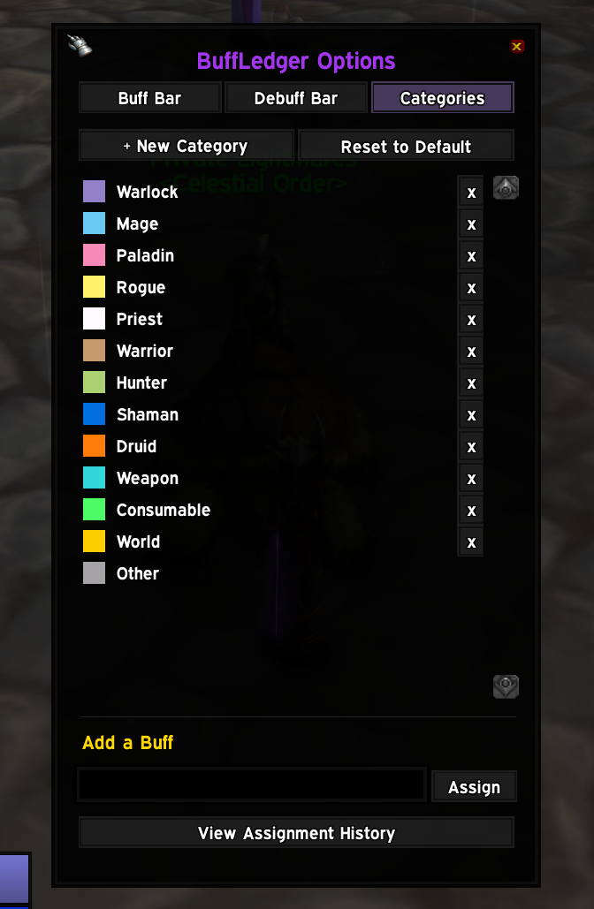
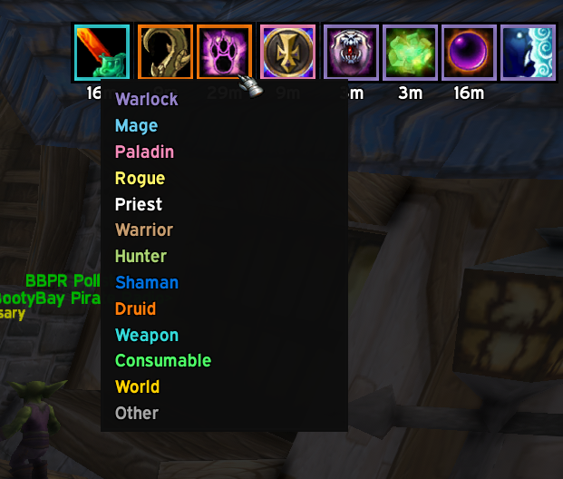
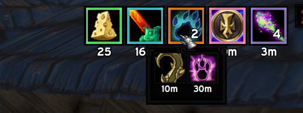

# BuffLedger

A buff bar for vanilla WoW 1.12 that actually organizes your buffs - grouped into color-coded categories instead of Blizzard's raw, meaningless aura order - and lets you bend that organization to whatever you actually want. Rename a category, recolor it, reorder it, delete it, or build your own from scratch. Reassign any single buff to any category, any time, in two clicks. When a category gets crowded, collapse it into one icon with a badge instead of a wall of clutter. None of this is hardcoded - it's your bar, edited the way you'd edit anything else.

A matching debuff bar shows what's on you the same way, color-coded by dispel type.

## Fully editable categories

Warrior, Paladin, Hunter, Rogue, Priest, Shaman, Mage, Warlock, Druid, Weapon, Consumable, World, Other - the defaults you start with aren't special. Every one of them is just data, and every one of them can be changed:

- **Recolor** - click a category's color swatch, pick a color, done.
- **Rename** or **delete** - delete anything except Other, which is the one permanent catch-all everything falls back to. Deleting a category never deletes the buffs in it - they just land in Other until you put them somewhere else.
- **Reorder** - drag a category up or down in the list and the buff bar re-sorts to match, immediately.
- **Create your own** - "+ New Category" gets you a name and a full stock color-wheel picker, together, in one step.
- **Reassign a buff** - shift-right-click any icon on the bar (or a member icon inside a consolidated popout) and pick a category from a color-coded dropdown. Don't have the buff active right now? Type its name into the Categories tab's "Add a Buff" box instead - same dropdown, no need to wait for a raid.
- **Full history** - every reassignment, however you made it, is logged. Open it from the Categories tab, and right-click any entry to send that buff somewhere else again.

Nothing here touches BuffLedger's own built-in recognition data (~300 buff names and counting, covering most of what you'll actually see). That data is what a deleted default category's buffs fall back to Other *from* - delete your Paladin category and a future update can still teach BuffLedger a new Paladin buff, it just won't matter for you until you bring Paladin back (Categories tab → Reset to Default, which restores any missing defaults without touching your custom ones or anything you've already reassigned).

## Consolidation

Once a category's cluster gets past a couple of icons - a 40-man raid buffing you with everything a class has - it can eat a lot of bar. Per category, not all-or-nothing: click the "C" toggle next to any category in the Categories tab, and just that one collapses whenever it hits 2+ buffs - a count badge, the timer of whichever buff in it is closest to falling off, and a hover popout showing the real icon and timer for every member. Want your class buffs spelled out but your consumables tucked away? Turn it on for Consumable and leave every class alone. Nothing is ever hidden, just tucked one hover deeper.

Two settings in the Buff Bar Options tab scope *when* consolidation is allowed to kick in at all, on top of whichever categories have their toggle on: only while grouped (party or raid), or only while specifically in a raid - so a quiet solo bar can stay uncollapsed and only tidy itself up when things would otherwise get crowded.

## Requires

**[ClassicAPI](https://github.com/brues-code/ClassicAPI)** - a client-side mod that exposes `C_UnitAuras`, the modern-shaped aura API this addon reads buffs through. It's not a regular addon and can't be installed by copying a folder into `Interface/AddOns/` - see that repo for install instructions. Without it, BuffLedger loads but does nothing (no bar, `/bl` doesn't respond) and prints a message saying so on login. pfUI's own buff module needs the same API, so if pfUI's buffs already work on your setup, ClassicAPI is already present and you don't need to do anything extra.

## Install

1. Copy the `BuffLedger` folder into `Interface/AddOns/`
2. Enable BuffLedger at the character select addon list

Looks like pfUI by default - the flat near-black border, drop shadow, and Expressway font are bundled straight from pfUI's own files, so it looks right whether or not pfUI is actually installed. Everything is still fully configurable from its own Options window regardless - it never reads pfUI's live settings, so pfUI being installed doesn't override anything you set here. Replaces Blizzard's stock buff/debuff icons outright, and pfUI's own buff/debuff display too if pfUI is loaded - only ever one set of icons on screen, no matter what else is installed.

## Usage

Drag either bar to reposition it (both start unlocked). `/bl options` (or the minimap button) opens the full settings window - Buff Bar and Debuff Bar tabs cover icon size, spacing, columns, font, text size, border thickness, scale, growth direction, and consolidation; the Categories tab covers everything above. The minimap button itself can be dragged around the minimap, or turned off entirely from the Buff Bar tab.

- `/bl` or `/buffledger` - full command list
- `/bl options` (or `/bl opt`, `/bl config`) - settings window (Buff Bar, Debuff Bar, and Categories tabs)
- `/bl lock` / `/bl unlock` - lock the buff bar in place, or free it to drag again (the debuff bar's lock is in its Options tab)
- `/bl reset` - reset buff bar position (the debuff bar has its own Reset Position button in its Options tab)
- `/bl scan` - scans your current raid/party and reports any buffs it doesn't recognize yet, with a guess at which class they belong to
- `/bl auras` - raw dump of every one of your own buffs and debuffs straight from the aura API (name, slot index, dispel type, time left) - a troubleshooting command for "why isn't this specific buff/debuff showing up on the bar"
- `/bl test [0-1 | % | off]` - preview a shuffled sample of every buff this addon knows about, without needing a raid to actually hold them all at once
- `/bl toggle <category name>` - show/hide one category, default or custom

## The debuff bar

A separate bar for what's on *you* - no categories, no sorting by source, since "who cast this on me" isn't a useful question for a debuff the way it is for a buff. Instead it's ordered by time remaining (shortest on the left, longest on the right) and each border is color-coded by dispel type - Magic, Curse, Poison, Disease - the same colors Blizzard's own tooltips use, so you can tell what's dispellable at a glance. Its own Options tab covers position, size, spacing, font, and lock, independently of the buff bar.

## How it works

The client's aura API has no concept of "who gave you this buff" - it's just a name, icon, and duration. BuffLedger keeps a lookup table (`Data.lua`) mapping buff names to a default category - a specific class, a world buff, a consumable, or Other for anything unrecognized (racials included - there aren't enough of them to earn their own category). That's only the *starting point* - see Fully editable categories above for how completely it can be overridden. Weapon enchants (sharpening stones, wizard oils, ...) aren't auras at all on this client, so those are read separately via `GetWeaponEnchantInfo()` and shown as their own category.

- **Grouped, not just sorted** - buffs from the same category sit together as one visual cluster, with a configurable gap between clusters. A cluster never splits across rows just because one ran out of horizontal room; it moves to the next row as a whole.
- **Sorted by time remaining within each cluster** - the buff closest to falling off is the most visually prominent one, not buried by alphabetical accident. A buff with no real timer (a permanent effect) sorts to the far end of its cluster instead, since it's never the one you need to react to first.
- **`/bl scan`** turns "is this buff in the lookup table yet" from a one-at-a-time guessing game into a single command - point it at a full raid and it'll tell you exactly which buffs it doesn't recognize, and which class it thinks each one belongs to.

## Known limitations

- The built-in name-to-category table is hand-maintained. Most standard buffs are already in it, but a private server's custom content can always add something new - if a buff lands in the generic "Other" bucket, that's what happened. `/bl scan` is the fastest way to find these, and shift-right-click (or the Categories tab's Add a Buff box) is the fastest way to fix them yourself without waiting on an update.
- A few consumables display under a short generic effect name in-game rather than the item's own name (e.g. Cerebral Cortex Compound's actual buff is "Infallible Mind") - most of these are already accounted for, but this is a real limitation of matching by aura name at all, not a bug.
- `/bl scan`'s raid-wide read assumes `C_UnitAuras.GetAuraDataByIndex` works against non-player unit tokens (`raid1`, `raid2`, ...) the same way it does for `"player"`. Every confirmed use elsewhere on this client only ever calls it with `"player"`, so this hasn't been independently verified.

## Credits

Built to match the look of [CombatLedger](https://github.com/kobeniiiiii/CombatLedger), [LootLedger](https://github.com/kobeniiiiii/LootLedger), and [CleanRolls](https://github.com/kobeniiiiii/CleanRolls) - the Expressway font and flat backdrop skin are bundled from [pfUI](https://github.com/shagu/pfUI) by Eric Mauser (Shagu), MIT-licensed.
